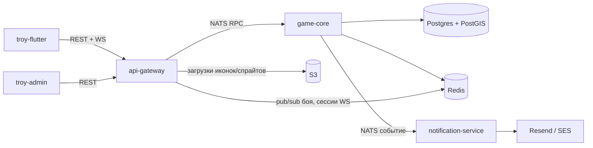

# system — как устроено сейчас

Troy — геолокационная RPG: игрок ходит по реальному миру, встречает монстров на карте, дерётся в
реальном времени, качается. Три репозитория: `troy-backend` (NestJS + Nx, 3 сервиса), `troy-flutter`
(мобильный клиент), `troy-admin` (веб-админка). Эта папка — карта **текущего поведения**, сверенная с
кодом; замысел и история — в `game-design/` и `roadmap/`.

## Сервисы

## Core loop → страницы

1. Регистрация / логин → auth (будет)
2. Создание / выбор персонажа → characters (будет)
3. Карта, поиск моба рядом → map (будет)
4. Бой с паком мобов → [battle](battle.md)
5. XP, level up, лут → [battle](battle.md), items (будет)
6. Экипировка, усиление → items (будет)
7. Мир вокруг (город → сота → зона, respawn) → [world](world.md)

## Подсистемы

| Страница | Что покрывает | verified |
|---|---|---|
| [battle](battle.md) | Real-time бой против пака: тик-движок, каст/канал, формулы, WS-контракт | 2026-09-27 |
| [world](world.md) | Город → территория (сота) → зона, еженедельный respawn | 2026-09-27 |
| infra (будет) | 3 сервиса, NATS, Docker Compose, env | — |
| auth (будет) | Регистрация, JWT, верификация email, восстановление пароля | — |
| characters (будет) | Персонажи, классы, computed stats, атрибуты | — |
| items (будет) | Инвентарь, экипировка, itemLevel/requiredLevel, дроп | — |
| mobs (будет) | Мобы, скиллы, AI-алгоритм выбора скилла | — |
| map (будет) | Позиция, anti-cheat, видимость сущностей, тайлы, клиентская карта | — |
| admin (будет) | Разделы админки, admin-guard, загрузки S3/sharp | — |
| client (будет) | Flutter: архитектура, сеть, состояние | — |

## Только в планах

Функциональность, для которой пока нет системной страницы, потому что её нет в коде:

- Vendors (торговцы на карте) — [roadmap/vendors](../roadmap/vendors/README.md)
- Кооп-бой (group-battle, этап 2) — [roadmap/group-battle](../roadmap/group-battle/README.md)
- Редизайн мешка — [roadmap/mvp-3-inventory/redesign.md](../roadmap/mvp-3-inventory/redesign.md)
- Зелья в бою — [roadmap/items](../roadmap/items/README.md)

## Как читать доки

`system/` — как устроено **сейчас** → `technical/` — контракты и схема (WS-события, БД) → `game-design/` —
замысел и формулы (не всегда совпадает с кодом — расхождения см. в разделе «Отличия от геймдизайна» каждой
страницы) → `roadmap/` — история и планы.

## Свежесть

`python3 scripts/docs-check.py` (из `troy-docs/`, `-v` — ещё и список коммитов). Для каждой страницы
`system/` печатает, сколько коммитов прошло в её коде (`paths` во frontmatter) после сверки (`backend`/
`flutter`/`admin` sha): `+0` — страница свежая, больше — пора перечитать код и обновить `verified`.
Exit 1 — только битые ссылки между доками или пути/символы кода, которых нет.
